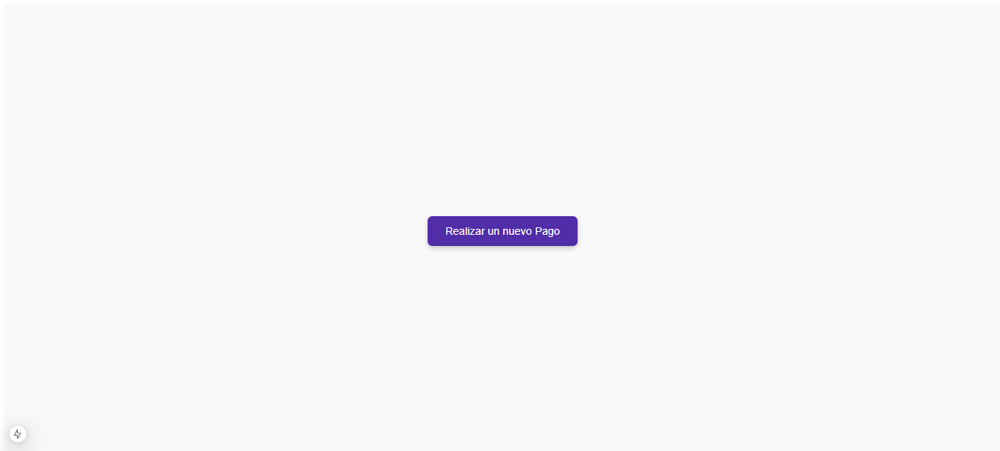
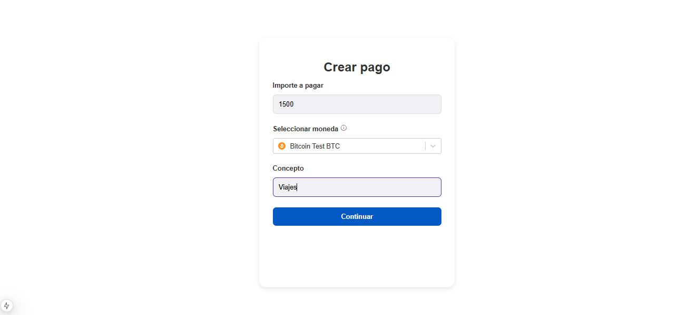
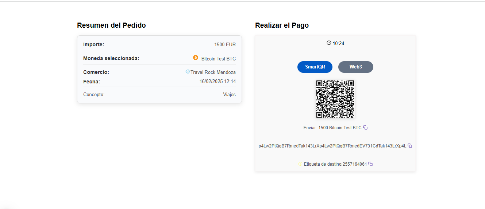
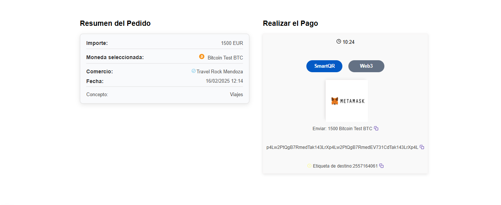
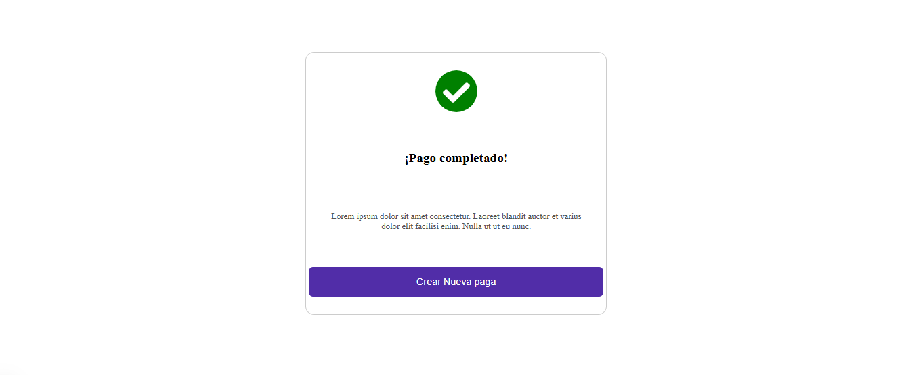
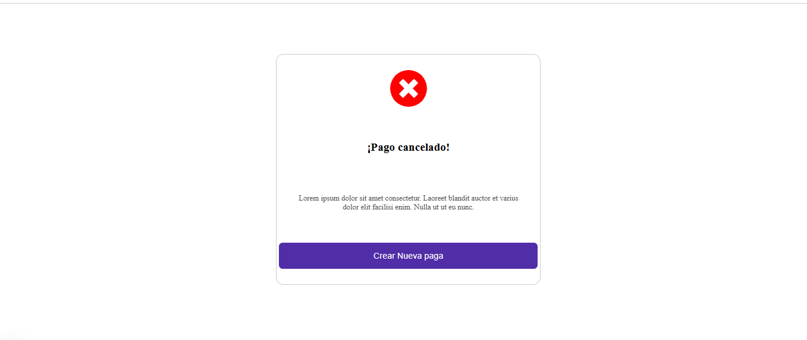

## Prueba técnica Bitnovo

## Joaquin Sebastian Zuin

------------

## Proyecto Prueba técnica Bitnovo

El desarrollo consiste en crear una pasarela de pago con criptodivisas. Esta se va a realizar en un entorno de testnet.

# Descripción del proyecto 
 El desarrollo principal consiste en una pantalla para crear el pago y otra para realizar el
pago.

La información sobre cada pantalla la tenemos a continuación:
- 1- Crear pago y selección de moneda.

El Merchant deberá poder crear un pago añadiendo el importe, concepto y criptodivisa.
Para crear el pago se hará uso del endpoint POST orders y para listar las criptodivisas
disponibles se hará con el endpoint GET currencies.
Los 3 campos mencionados anteriormente deberán introducirse en una misma pantalla y las
criptodivisas que se podrán seleccionar para crear el pago variarán en función del importe
del pago. Hay que controlar el importe máximo y mínimo de cada moneda.

- 2- Pasarela de pago QR.

Una vez el pago esté creado debemos mostrar todos los datos del resumen del pago y la
información para que el Cliente pueda realizarlo. Todos estos datos los podemos obtener
haciendo uso del endpoint GET orders/info.
Importante: la pasarela de pago debe refrescarse en tiempo real, es decir, si se recibe un
pago la pantalla se debe refrescar de forma automática. Al crear un pago, se crea un
websocket el cual se puede escuchar para recibir notificaciones de cambio de estado.
Ejemplo de websocket:
const socket = new WebSocket('wss://payments.pre-bnvo.com/ws/<identifier>');
Simplemente habría que añadir en cada caso el identifier que devuelve el endpoint al crear
un pago.
Hay que tener en cuenta que los pagos tienen un tiempo de expiración y que debe llevarnos
a una pantalla KO si caduca (estado “EX” o “OC”). En cambio, si el pago se realiza
correctamente (estado “CO” o “AC”), nos llevará a una pantalla OK.

# Uso de la app

- El sistema cuando se inicia 

- Pantalla crear pago

- Pantalla de resumen y realizar pago.

- Pantalla pago exitoso.

- Pantalla pago caducado.

# Deploy

Puede ejecutar el proyecto desde el siguiente link:
[https://joa-zuin-bitnovo.vercel.app/](https://joa-zuin-bitnovo.vercel.app/)

#

